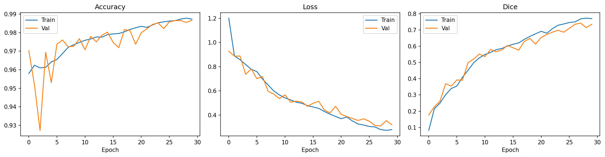
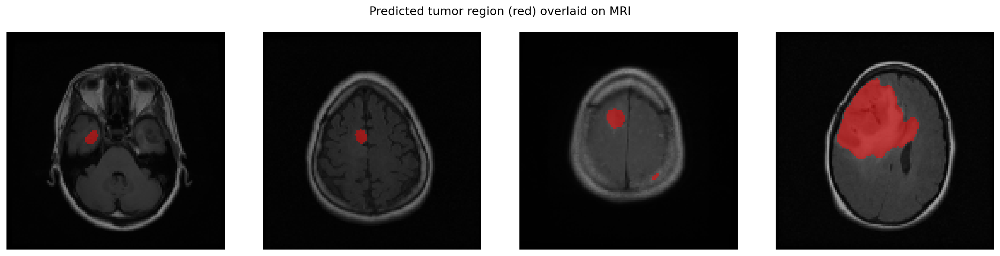

# Brain Tumor Segmentation — U-Net — Brain MRI

A deep learning model that looks at a brain MRI scan and automatically
outlines exactly where a tumor is, pixel by pixel.

**Result: Dice score of 0.75 on scans the model had never seen before.**

---

## What is image segmentation?

Most people have heard of image *classification* — a model looks at a photo
and says "this is a cat." Segmentation goes further: instead of labelling
the whole image, it labels **every single pixel**.

So for a brain MRI, the model doesn't just answer "is there a tumor?" It
answers "which exact pixels *are* the tumor?" The output is a mask — a
black-and-white image where white marks tumor and black marks everything
else.

Think of it as the difference between saying "there's a tumor in this scan"
and drawing a precise outline around it with a marker.

## Why build this?

Radiologists currently outline tumors by hand, slice by slice. A single
patient's MRI can have dozens of slices, and each one takes time and
concentration. It's slow, and two doctors can draw slightly different
boundaries.

An automated model can:
- Outline tumors in seconds instead of minutes
- Give consistent boundaries every time
- Measure tumor size and track whether it grows or shrinks between scans

This isn't meant to replace a doctor — it's meant to give them a starting
point they can adjust, so they spend their time on judgement instead of
tracing.

## The dataset

[LGG MRI Segmentation](https://www.kaggle.com/datasets/mateuszbuda/lgg-mri-segmentation)
— brain MRI scans from real patients, each paired with a mask that doctors
drew by hand showing the true tumor location.

Those hand-drawn masks are the "answer key." The model learns by comparing
its guesses against them, over and over, until its outlines match.

The full set has **3,929 slices**, of which **1,373 (34.9%) contain a
tumor**. That imbalance turns out to matter a lot — see below.

## How U-Net works

U-Net is the model architecture. Its name comes from its shape — it goes
down, then back up, like the letter U.

**Going down (the encoder):** the image is compressed step by step. The
model loses fine detail but learns *what* it's looking at — edges, textures,
shapes that look like tumor tissue.

**Going up (the decoder):** the compressed understanding is expanded back to
full size, so the model can say *where* the tumor is and draw the mask.

**The shortcuts (skip connections):** here's the clever part. Fine detail
lost on the way down is passed directly across to the way up. That's why
U-Net can draw sharp, precise outlines instead of blurry blobs — and why
it's the standard choice for medical imaging.

## The problem I had to solve

The first version of this model failed completely. It predicted "no tumor"
on every single pixel — the output masks came back entirely black.

The strange part: it reported **99% accuracy**.

That's the trap. The imbalance runs at two levels: about 65% of slices have
no tumor at all, and even inside a tumor slice, the tumor is only a small
patch of the total pixels. Across the whole dataset, roughly 1% of pixels
are tumor. So a model that predicts "background, background, background"
for everything is right 99% of the time. It scored beautifully while being
completely useless.

Three changes fixed it:

1. **Changed the loss function to combined BCE + Dice.** The original loss
   let "predict nothing" look like a great answer. Dice loss measures
   *overlap* with the true tumor, so predicting nothing scores zero — the
   model is forced to actually find the tumor.

2. **Lowered the learning rate to 1e-4.** The model was taking steps so big
   it leapt straight to the useless all-black answer on the first epoch and
   never left. Smaller steps let it learn gradually.

3. **Trained only on the 1,373 slices that contain a tumor.** Feeding it
   mostly-empty images drowned the signal. Showing it slices that actually
   have something to find gave it something to learn from.

Dice went from **~0.00 to ~0.75**.

## Why Dice, not accuracy

Accuracy is meaningless here, for the reason above — 99% accuracy described
a model that found nothing.

**Dice score** measures how much the predicted mask overlaps the true mask.
1.0 means a perfect match; 0.0 means no overlap at all. If the model
predicts nothing, Dice is 0 — no hiding.

That's why every plot and result below reports Dice.

---

## Results

### Training curves

The Dice panel on the right is the one that matters. Both the training line
and the validation line climb together to about **0.77 / 0.74**.

Two things this tells us:
- **The model is learning** — Dice rising means predictions increasingly
  overlap real tumors
- **It isn't cheating** — validation is measured on scans held back from
  training. Since both lines rise together, the model learned real patterns
  rather than memorizing specific images

The middle panel shows loss falling steadily for both, from ~1.20 down to
~0.28 — the model's mistakes shrinking over time.

### Predicted masks

Three columns, on scans the model never saw during training:
- **Left** — the original MRI slice
- **Middle** — the true mask a doctor drew by hand
- **Right** — the model's prediction

The model finds the tumor in roughly the right place and shape. It's not
pixel-perfect — edges are rougher than the doctor's outline — which is
exactly what a Dice of 0.75 looks like in practice.

### Tumor overlay

The predicted mask painted in red on top of the original MRI. This is the
form a radiologist would actually want to look at — the detection shown in
context, on the scan itself, rather than as a separate black-and-white
image.

---

## Setup

| Component | Choice |
|---|---|
| Model | U-Net (2,066,497 parameters) |
| Input | 128×128 grayscale MRI slices |
| Output | Binary tumor mask |
| Loss | Combined BCE + Dice |
| Optimizer | Adam, learning rate 1e-4 |
| Training | 30 epochs, batch size 16, on 1,373 tumor slices |
| Framework | TensorFlow / Keras |

## Results summary

| Metric | Score |
|---|---|
| Test Dice | **0.7481** |
| Train Dice (final epoch) | 0.7706 |
| Validation Dice (final epoch) | 0.7359 |
| Test accuracy | 0.9867 (not meaningful — see above) |

## How to run

1. Open `unet_lgg_segmentation.ipynb` in Google Colab
2. Switch to a GPU runtime: **Runtime → Change runtime type → T4 GPU**
   (on CPU this takes hours instead of minutes)
3. Add your Kaggle API token in Cell 1 (Kaggle → Settings → API)
4. Run the cells in order

Training takes about 6 minutes on a T4 GPU (~10s per epoch after the first).

## Tech stack

Python · TensorFlow/Keras · OpenCV · NumPy · scikit-learn · Matplotlib

## Limitations

- Trained only on tumor-containing slices, so the model hasn't learned to
  say "no tumor here" — it assumes one exists. A production system would
  need a classification stage first, or retraining with negatives handled
  properly.
- Uses grayscale input; the original scans have three channels that could
  carry extra useful information
- 0.75 Dice is good but not clinical-grade; predicted edges are rougher
  than expert outlines
- Trained on one dataset from one source, so it may not transfer to scans
  from different machines or hospitals
- The curves were still improving at epoch 30 — longer training or
  augmentation would likely push Dice higher
